### Android-ScorerApp
[](http://forthebadge.com)
[](http://forthebadge.com)


A simple app which works as a real time scorer for different games.
Curently this app works as a real time scorer in a basketball game. Just as Basketball game can have either +3,+2 or a free throw(+1) as points this can work as a score card. This app is also available for games like Volley ball, Badminton, Table Tennis, Cricket, Foot ball, Kabaddi and Lawn Tennis.
The app is also engrossed with the features of Undo and reset.Reset sets score of both teams to 0 while individual undo buttons for both teams helps app user to correct his/her mistake in awarding points.

## Features
 * [x] No need to note the details manually.
 * [x] An app enhances the authenticity for the results.
 
 ### Show some :heart: and star the repo to support the project
  
 ### Screenshots
 
  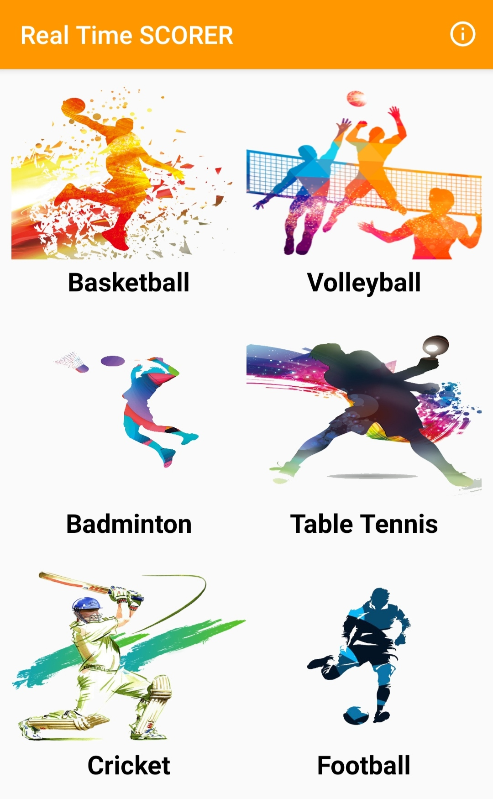 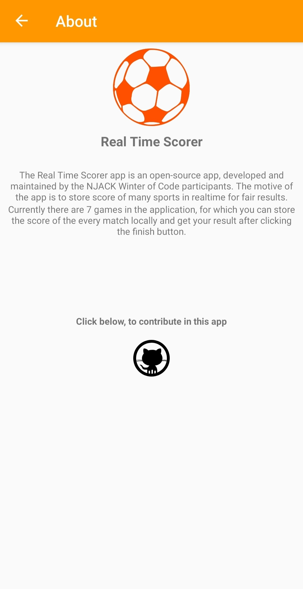 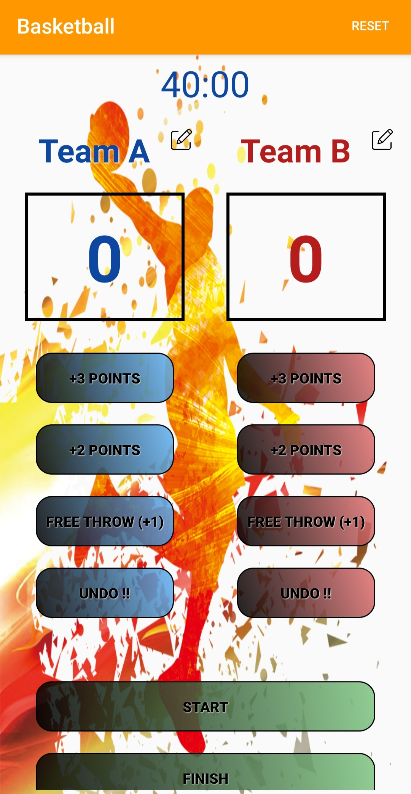 
 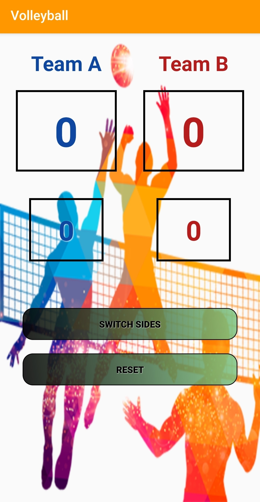 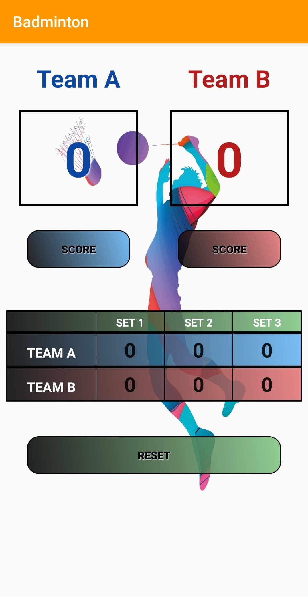 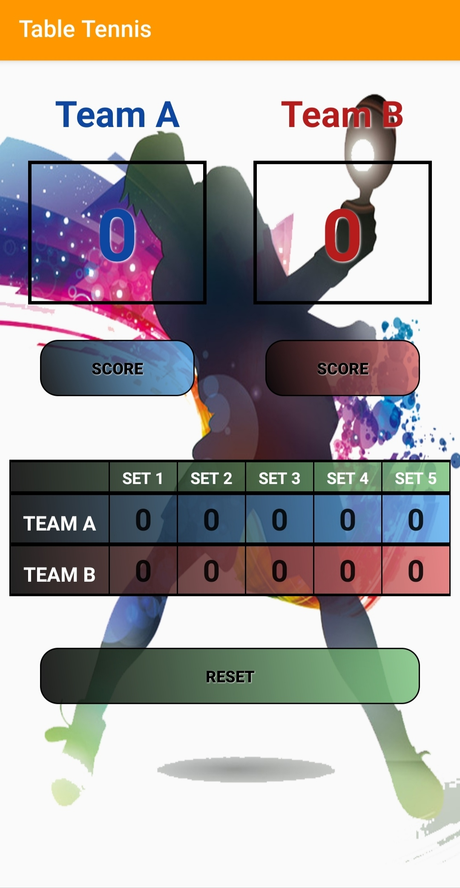 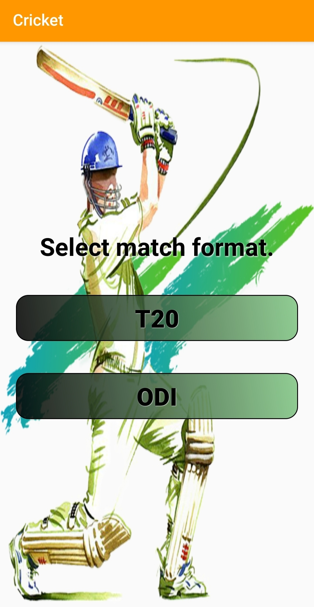
 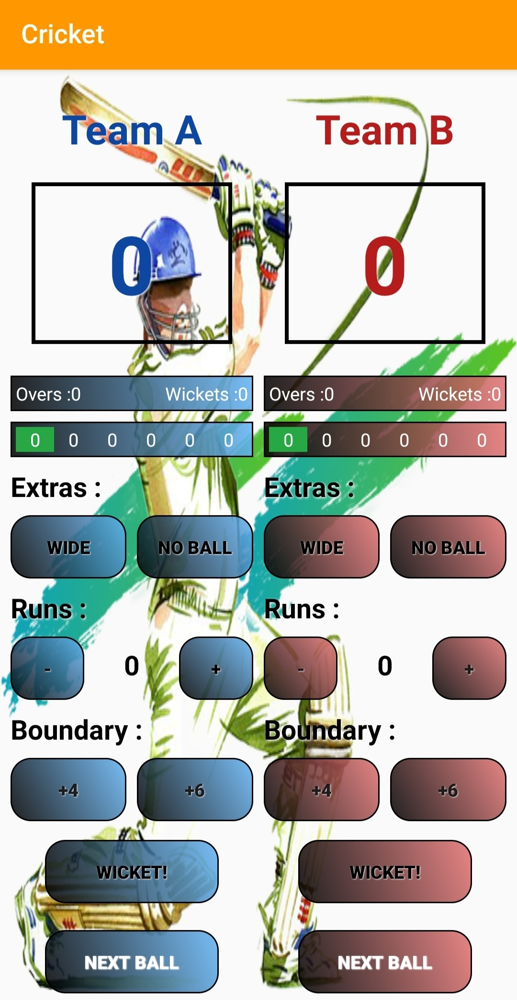 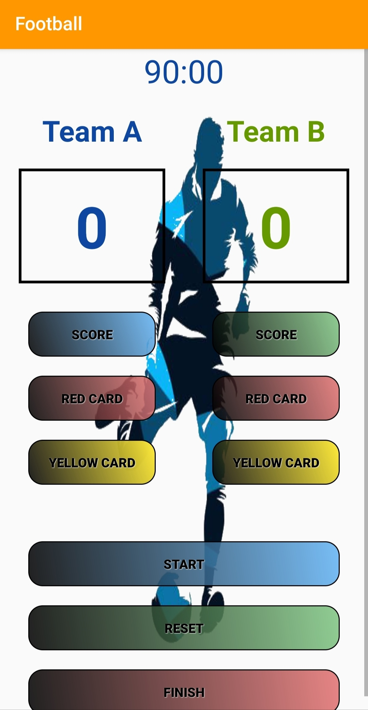 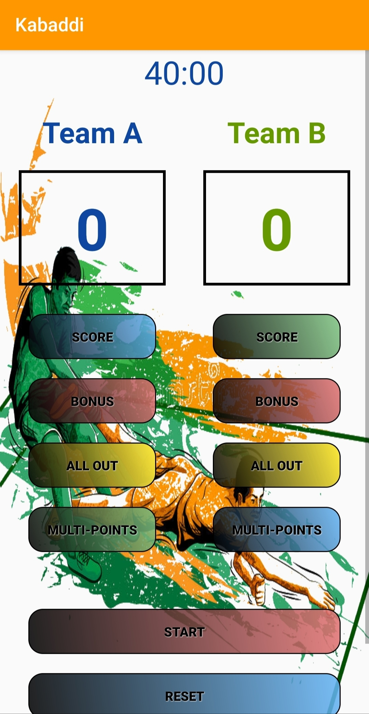 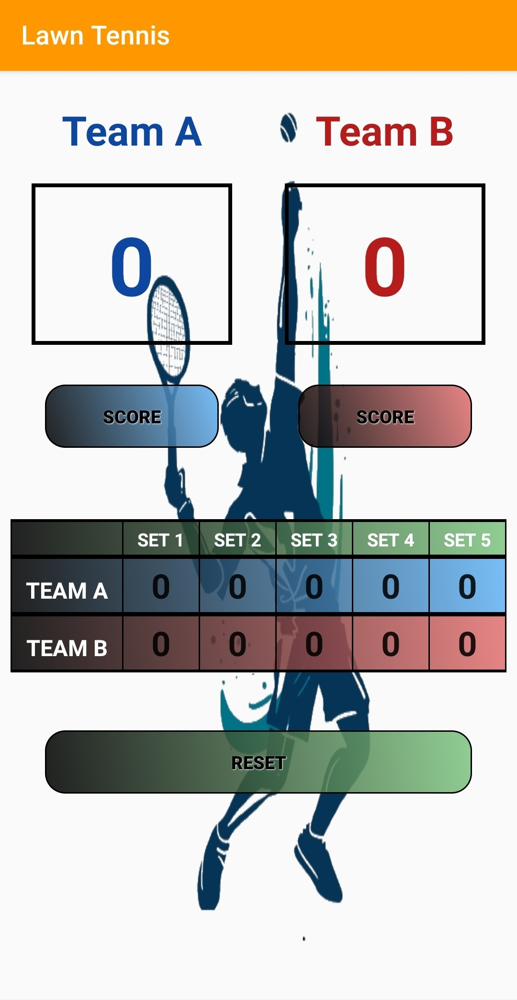

### Download the app

You can download by clicking [here](https://github.com/NJACKWinterOfCode/Android-ScorerApp/raw/master/Scorecounter/app/release/scorer.apk)

### Install and contribute

```sh
$ git clone https://github.com/NJACKWinterOfCode/Android-ScorerApp.git
```
Then open in Android Studio.

### Rules
* Claim the issue first before start working on it.
* Work on one issue at a time.
* Create separate pull requests for different issues.
* Complete the work within 3 days after claiming an issue.
